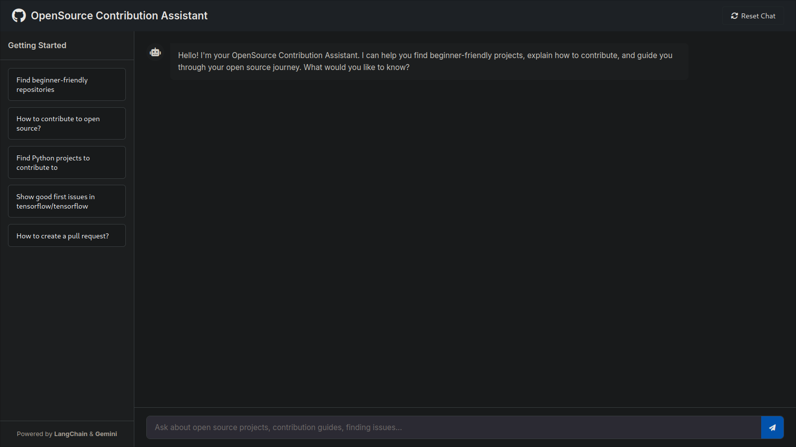

# Open Source Agent

A smart assistant for discovering and contributing to open source projects. This AI-powered chatbot helps users find GitHub repositories, understand contribution guidelines, and explore trending technologies, repositories, and community discussions in real time.

---

## Note
This project uses Gemini API on a free-tier plan, which includes rate limits. The deployed version hosted on Render may occasionally hit those limits. If you're accessing the site via the link in the description of this repository, please be mindful of potential delays or temporary unavailability.


## Features

- Search and recommend beginner-friendly GitHub repositories.
- Discover open issues labeled as "good first issue", "help wanted", etc.
- Fetch and summarize contribution guidelines.
- Analyze repository insights: commit activity, PR merge rates, technologies, etc.
- Crawl the web (GitHub Trending, Dev.to, Reddit, RSS feeds) for open-source trends.
- Conversational memory to track chat history and user preferences.
- Surface relevant Stack Overflow discussions for help.

---

## Project Structure

```
open-source-agent/
├── app.py                # Flask backend and LangChain logic
├── requirements.txt      # Python dependencies
├── static/
│   ├── script.js         # Frontend script
│   └── styles.css        # Frontend styles
├── templates/
│   └── index.html        # Chat interface
└── venv/                 # Virtual environment
```

---

## Setup

### 1. Clone the Repository

```bash
git clone https://github.com/yourusername/open-source-agent.git
cd open-source-agent
```

### 2. Set up Virtual Environment

```bash
python3 -m venv venv
source venv/bin/activate
```

### 3. Install Dependencies

```bash
pip install -r requirements.txt
```

### 4. Add Environment Variables

Create a `.env` file with:

```env
GOOGLE_API_KEY=your_google_gemini_api_key
GITHUB_TOKEN=your_github_token
```

---

## How It Works

This application uses:

- **Flask** for web server & API routing.
- **LangChain** + **Google Gemini** + **FastEmbedEmbeddings** for smart conversation and embeddings.
- **FAISS** for semantic search on curated open-source contribution data.
- **GitHub API** to fetch repositories, issues, insights.
- **Web scraping** & **RSS feeds** to fetch trending resources.
- **StackExchange API** for fetching Stack Overflow Q&A.

---

## API Endpoints

| Endpoint                        | Method | Description                                |
|--------------------------------|--------|--------------------------------------------|
| `/`                            | GET    | Home page                                  |
| `/api/chat`                    | POST   | Main chatbot endpoint                      |
| `/api/search/repositories`     | GET    | Search GitHub repositories                 |
| `/api/search/issues`           | GET    | Fetch issues from a repo                   |
| `/api/contribution_guide`      | GET    | Get contribution guide for a repo          |
| `/api/project_insights`        | GET    | Analyze activity, community, and tech stack|
| `/api/trending`                | GET    | Get real-time open-source trends           |
| `/api/stackoverflow`           | GET    | Fetch Stack Overflow discussions           |
| `/api/reset`                   | POST   | Reset chat session and memory              |
| `/start-conversation`         | POST   | Start a new conversation session           |

---

## Running Locally

```bash
python app.py
```

Access the chatbot at: [http://localhost:5000](http://localhost:5000)


---

## Deployment

Currently live on: [render](https://open-source-agent-uvwi.onrender.com/)

---

## Demo


---


## License

MIT License

---

## Acknowledgments

- [LangChain](https://github.com/langchain-ai/langchain)
- [Google Gemini API](https://ai.google.dev/)
- [GitHub REST API](https://docs.github.com/en/rest)
- [FAISS](https://github.com/facebookresearch/faiss)
